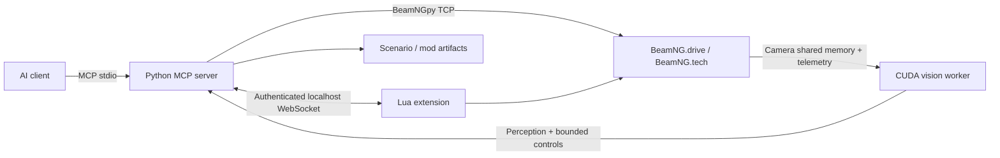

# BeamNG MCP

A local-first [Model Context Protocol](https://modelcontextprotocol.io/) server for
controlling BeamNG.drive/BeamNG.tech, authoring scenarios and map content, testing mods,
and building GPU-assisted autonomous-driving experiments.

> **Status:** early public preview. The BeamNGpy path is functional and testable without
> the game. The Lua extension is a version-sensitive optional path because WebSocket
> availability differs across BeamNG releases. Never use this software on public roads
> or to control a physical vehicle.

## Architecture



The primary control plane uses official BeamNGpy APIs. The Lua bridge exists for
engine operations not exposed by BeamNGpy and deliberately has no arbitrary-code tool.
The vision package lazy-loads so normal MCP operation does not reserve GPU memory.

## Tool surface

| Tool | Purpose |
|---|---|
| `beamng_status`, `beamng_connect` | Health and simulator lifecycle |
| `scenario_create`, `scenario_load`, `scenario_export` | Build and persist scenarios and procedural roads |
| `vehicle_state`, `vehicle_control`, `vehicle_emergency_stop` | Telemetry and dead-man-guarded driving |
| `vehicle_ai_mode` | Configure BeamNG's built-in traffic/route AI |
| `map_roads` | Inspect road graph and road-edge geometry |
| `camera_attach`, `vision_observe` | Shared-memory camera capture and one-shot CUDA inference |
| `lua_call` | Five allow-listed engine-extension operations |
| `vision_load` | Lazy-load a CUDA perception model |

The codebase exposes foundations for camera inference; a closed-loop vision controller
is intentionally not enabled by default. It should be calibrated per map, camera, model,
and target frame rate before assist mode is allowed.

## Install

Prerequisites: Windows, Python 3.11+, BeamNG.drive or BeamNG.tech compatible with your
BeamNGpy release, and optionally an NVIDIA GPU with a recent CUDA-capable PyTorch build.

```powershell
git clone https://github.com/eric-rolph/beamng-mcp.git
cd beamng-mcp
py -3.11 -m venv .venv
.\.venv\Scripts\Activate.ps1
pip install -e ".[dev]"
Copy-Item .env.example .env
```

Edit `.env` with the installation/user paths reported by the BeamNG launcher. Generate
a strong secret, for example:

```powershell
python -c "import secrets; print(secrets.token_urlsafe(32))"
```

For vision, install PyTorch using the command recommended for your CUDA driver, then:

```powershell
pip install -e ".[vision]"
```

On an RTX 5090, begin with a small detector and 512–640 px camera frames at 10 Hz. Keep
BeamNG rendering and inference on the same GPU only after measuring VRAM headroom and
frame-time percentiles. TensorRT-exported models are a later optimization; correctness,
shared-memory capture, and backpressure come first.

## Configure an MCP client

The default transport is stdio. A generic client entry looks like:

```json
{
  "mcpServers": {
    "beamng": {
      "command": "C:\\path\\to\\beamng-mcp\\.venv\\Scripts\\beamng-mcp.exe",
      "env": {
        "BEAMNG_MCP_HOME": "C:\\Program Files (x86)\\Steam\\steamapps\\common\\BeamNG.drive",
        "BEAMNG_MCP_USER_PATH": "C:\\Users\\YOU\\AppData\\Local\\BeamNG.drive\\0.37",
        "BEAMNG_MCP_LUA_SHARED_SECRET": "replace-me"
      }
    }
  }
}
```

Start BeamNG first and enable its external API, or set `BEAMNG_MCP_LAUNCH=true` where
supported. Then call `beamng_connect`, create/load a scenario, and query vehicle state.

## Lua extension

Copy `beamng_extension` into an unpacked mod folder:

```text
<BeamNG user path>/mods/unpacked/beamng_mcp/
  lua/ge/extensions/beamngMcp.lua
  mod_info/beamng_mcp/info.json
```

Load it from the BeamNG Lua console with:

```lua
extensions.load('beamngMcp')
```

The extension binds to no network port; it connects out to `ws://127.0.0.1:8765`,
authenticates, and accepts only `ping`, `getVehicleData`, `setTimeOfDay`, `spawnPrefab`,
and `removeObject`. Some BeamNG distributions do not ship a `websocket` Lua module. In
that case the extension logs a clear error and all BeamNGpy tools remain available. A
future compatibility package can bundle a pinned pure-Lua RFC 6455 client after testing
against supported BeamNG versions.

## Autonomous-driving roadmap

The intended loop is camera shared memory → CUDA inference → telemetry fusion → bounded
policy → `vehicle_control`. Robust operation requires more than object detection:

1. Camera/depth/annotation sensor manager with bounded queues and timestamps.
2. Lane/free-space segmentation and object tracking, optionally TensorRT FP16.
3. Ego-state fusion with IMU, wheel speed, and map graph.
4. A deterministic planner/controller running at a fixed rate independent of the LLM.
5. Shadow/replay evaluation, intervention metrics, and scenario regression suites.

An LLM should set goals and inspect runs, not sit in the millisecond steering loop. The
real-time policy stays local and deterministic; MCP remains the supervisory interface.

## Development

```powershell
uv sync --extra dev
uv run ruff check .
uv run pytest -q
```

Tests use adapters and do not require the game. Integration tests requiring proprietary
BeamNG binaries should remain opt-in and must not run in public CI.

## References

- [BeamNGpy documentation](https://documentation.beamng.com/api/beamngpy/)
- [BeamNGpy repository](https://github.com/BeamNG/BeamNGpy)
- [Official MCP Python SDK](https://github.com/modelcontextprotocol/python-sdk)

## License

MIT. BeamNG, BeamNG.drive, and BeamNG.tech are trademarks of BeamNG GmbH. This project
is community software and is not affiliated with or endorsed by BeamNG GmbH.
