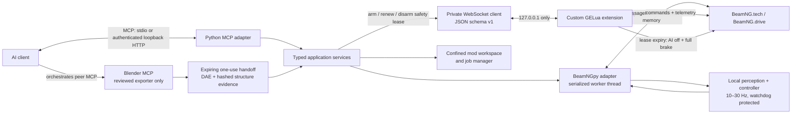

# BeamNG MCP

<!-- mcp-name: io.github.eric-rolph/beamng-mcp -->

[](https://github.com/eric-rolph/beamng-mcp/actions/workflows/ci.yml)
[](https://www.python.org/)
[](https://github.com/eric-rolph/beamng-mcp/blob/main/LICENSE)

A local, safety-gated [Model Context Protocol](https://modelcontextprotocol.io/) server for
controlling, inspecting, extending, and testing BeamNG simulations. It combines the official
[BeamNGpy](https://github.com/BeamNG/BeamNGpy) Python API with an authenticated GELua WebSocket
extension and a GPU-ready real-time perception/control loop.

BeamNG MCP is deliberately split into a low-rate AI control plane and a high-rate local driving
data plane. An LLM can choose scenarios, build mods, inspect a map, and start an episode; it is
never placed inside the 10–30 Hz steering/braking loop.

> [!WARNING]
> Alpha software for simulation only. Keep a manual emergency-stop path available. Do not use
> this project to control a real vehicle.

## Feature tiers

| Capability | BeamNG.tech 0.38 | Retail BeamNG.drive 0.38 |
| --- | --- | --- |
| BeamNGpy vehicles, scenarios, traffic, timing, environment | Supported | Experimental / build-dependent |
| Cameras, lidar, radar, GPS, IMU, shared memory | Supported | Camera is license-gated in tested 0.38.6; other sensors build-dependent |
| Custom GELua WebSocket, telemetry, engine safety lease, emergency stop | Supported | Experimental, targets 0.38.6 |
| Live scene-object creation/update/delete | Supported through GELua | Experimental through GELua |
| Typed ephemeral BeamNGTrigger drafts, lifecycle, and enter/exit events | Supported through GELua | Experimental, live-tested against 0.38.6 |
| Persistent level save | Explicitly gated; World Editor required | Explicitly gated; World Editor required |
| Mod scaffold/validate/pack/install | Supported; install is operator-gated | Supported; install is operator-gated |
| Blender-evidenced soft-body authoring and deterministic JBeam assembly | Offline authoring supported; in-game validation required | Offline authoring supported; in-game validation required |
| Native AI and real-time vision driving | Supported | Native AI experimental; production vision/hybrid requires Tech camera in tested 0.38.6 |

BeamNGpy's official support contract is for BeamNG.tech. Retail Drive support is useful, but this
repository labels it honestly as experimental. The pinned compatibility baseline is BeamNGpy
1.35.1 with BeamNG 0.38.

## What is included

- 57 typed MCP tools across simulator, scenario, traffic, environment, vehicle, sensor, map, Lua,
  mod, soft-body authoring, job, and autonomous-driving domains.
- Read-only MCP resources for status, vehicles, jobs, autonomy, and the soft-body authoring
  contract, plus guided workflow prompts.
- A loopback-only GELua WebSocket server with a per-install secret, bounded messages and queues,
  correlation IDs, heartbeats, an explicit method allowlist, and no dynamic Lua evaluation.
- Vehicle control, native AI, deterministic stepping, scenario creation, road-network queries,
  RGB/depth/annotation cameras, lidar, radar, ultrasonic, GPS, IMU, electrics, damage, state,
  roads, and powertrain sensors through BeamNGpy.
- Path-confined, quota-bounded mod workspaces with atomic writes, SHA-256 optimistic concurrency,
  validation, correctly rooted zip packages, and recoverable install backups. Installation is
  disabled until the operator opts in.
- A peer-MCP Blender workflow with expiring one-use inboxes, a version-controlled exporter,
  exact evaluated-cage-vertex evidence, explicit coordinate transforms, deterministic JBeam nodes,
  beams/X-braces/triangles, typed hydros and rails/slidenodes, mass-preserving heavy bases, and
  full build provenance. JBeam coordinates are never accepted from prose.
- Live map object changes through GELua. Existing level objects and persistent saves have separate,
  default-off operator gates; deletes and saves also require explicit confirmation.
- A dedicated `BeamNGTrigger` lifecycle that creates connection-owned drafts, instantiates only on
  explicit enable, emits bounded typed enter/exit events, and never accepts Lua or command fields.
- Three selectable driving modes: BeamNG native AI, vision lane keeping, and a reserved hybrid
  mode. In the current alpha, `hybrid` uses the same camera-plus-vehicle-state supervisor as
  `vision-lane`; route-planner fusion remains roadmap work.
- OpenCV lane perception, lazy Hugging Face SegFormer, and ONNX Runtime with TensorRT → CUDA →
  CPU provider fallback and bounded GPU/workspace memory.
- An engine-side real-time safety lease that must arm before autonomy starts. GELua disables AI and
  applies service plus parking brake if Python stops renewing it.
- An independent stale-frame/command watchdog, confidence and hazard speed governor, actuation
  clamps, and full-brake emergency behavior.

## Architecture



MCP is not the video or actuation transport. Camera frames stay in shared memory/local process
memory, and normalized controls go directly back through BeamNGpy. See
[Architecture](https://github.com/eric-rolph/beamng-mcp/blob/main/docs/ARCHITECTURE.md) for lifecycle, trust boundaries, and design decisions.

## Quick start on Windows

Prerequisites:

- BeamNG.drive 0.38 or BeamNG.tech 0.38
- Python 3.11–3.13
- [`uv`](https://docs.astral.sh/uv/)
- An MCP-capable AI client
- Optional for soft-body builds: a Blender runtime with a selection-only Collada exporter and the
  Blender MCP add-on enabled in that exact version profile

```powershell
git clone https://github.com/eric-rolph/beamng-mcp.git
Set-Location .\beamng-mcp
uv sync --extra dev
uv run beamng-mcp doctor
uv run beamng-mcp install-lua
```

`install-lua` resolves BeamNG's current user folder, creates an unpacked mod there, and generates a
local secret without printing it. For BeamNG 0.37 and later, the Windows default is
`%LOCALAPPDATA%\BeamNG\BeamNG.drive\current`; a custom `userFolder` in
`%LOCALAPPDATA%\BeamNG\BeamNG.drive.ini` takes precedence. The launcher command
**Manage User Folder → Open in Explorer** is the authoritative manual check. See BeamNG's official
[version and user-folder discovery reference](https://documentation.beamng.com/support/version/).

The installed `modScript.lua` loads `beamng_mcp/bridge` when the mod is activated. BeamNGpy also
requests the extension during `simulator_connect`, and it may be loaded manually from GELua for
troubleshooting.

When multiple simulator or Blender versions are installed, copy `beamng-mcp.example.toml` and set
the direct `beamng.binary` plus `blender.executable`. `doctor --json` reports the exact Blender
runtime and active user/add-on profile's Collada operator set, selection-only capability, and
deterministic glTF availability without launching BeamNG. With no explicit Blender path, it probes
common side-by-side candidates until it finds a compatible DAE runtime.

Start the default stdio server:

```powershell
uv run beamng-mcp serve --transport stdio
```

Example client configuration:

```json
{
  "mcpServers": {
    "beamng": {
      "command": "C:/absolute/path/to/beamng-mcp/.venv/Scripts/beamng-mcp.exe",
      "args": ["serve", "--transport", "stdio"]
    }
  }
}
```

Run `uv run beamng-mcp client-config` to generate a configuration using the active environment.
For detailed game, bridge, and HTTP setup, read [Setup](https://github.com/eric-rolph/beamng-mcp/blob/main/docs/SETUP.md).

## First safe interaction

Ask the AI client to follow this sequence:

1. Call `capabilities_get`, `simulator_status`, and `lua_bridge_status`.
2. Call `simulator_connect` only after checking the configured installation.
3. List scenarios and vehicles before choosing or creating anything.
4. For a new level, read `map_road_network`/`map_road_edges`, then add the model's origin clearance
   to measured surface Z before every `vehicle_spawn`. The validated default is `cling=false` so
   BeamNG preserves that clearance; opt-in cling cannot reliably project from an arbitrary height.
   BeamNGpy does not apply cling to `Scenario.add_vehicle`, so persistent placements need the same
   explicit surface-relative calculation (base-origin static props can use the surface Z directly).
5. Confirm the installed GELua bridge is authenticated; `autonomy_start` fails closed if its
   engine safety lease cannot arm for the selected vehicle.
6. Start with BeamNG native AI at a low target speed.
7. Poll `autonomy_status`, including the `engine_deadman_*` fields; call `emergency_stop` on stale
   frames, unexpected motion, or operator request.

The server also provides `inspect_current_scene`, `build_and_test_mod`, `build_softbody_mod`, and
`cautious_autonomous_run` MCP prompts.

## Vision on an RTX 5090

Install optional model runtimes:

```powershell
uv sync --extra vision --extra dev
```

On Windows, this repository pins `torch` to PyTorch's official CUDA 12.8 wheel index through
uv, so the vision extra does not silently install a CPU-only PyPI build. ONNX Runtime GPU is
constrained below 1.27 because 1.27 removed CUDA 12 support while this profile uses CUDA 12.8.
Run `uv run beamng-mcp doctor --json` and require
`vision_runtime.torch.cuda_available=true` before selecting SegFormer. For ONNX/CUDA, also require
`vision_runtime.onnxruntime.provider_libraries.CUDAExecutionProvider.loadable=true`; an advertised
provider alone does not prove that its DLL dependencies load. TensorRT is optional and should be
treated as unavailable when its corresponding `loadable` field is false. The ONNX backend preloads
the CUDA/cuDNN libraries shipped with the compatible PyTorch installation before creating a GPU
session.

The default `classical` backend is small and deterministic. For semantic road/hazard perception,
configure `segformer` or provide a segmentation ONNX model:

```toml
[vision]
backend = "onnx"
onnx_path = "C:/models/drivable-area.onnx"
target_fps = 20
input_width = 640
input_height = 360
max_gpu_memory_mb = 4096
```

ONNX Runtime prefers `TensorrtExecutionProvider`, then CUDA, then CPU. Engine caches are not
committed because TensorRT engines are specific to the runtime/GPU combination. On an RTX 5090,
start at 640×360, cap BeamNG's frame rate, reserve 4–6 GB for inference, use FP16, and measure
end-to-end observation-to-actuation latency before increasing resolution. Confirm the session's
actual provider in `autonomy_status`; provider-library readiness is necessary but does not prove a
particular model initialized. NVIDIA's
[simultaneous compute and graphics guidance](https://docs.nvidia.com/deeplearning/tensorrt-rtx/latest/inference-library/compute-graphics.html)
is especially relevant when the game and inference share the same GPU.

The SegFormer backend does not download weights unless `allow_model_downloads = true`; this
prevents surprise network traffic. See [Autonomy and Vision](https://github.com/eric-rolph/beamng-mcp/blob/main/docs/AUTONOMY.md).
The opt-in GPU regression captures a real rendered BeamNG frame through a test-only retail
RenderView fixture and runs OpenCV, with an optional pre-cached SegFormer-B0 CUDA leg. It is not a
production retail camera fallback: BeamNG.drive 0.38.6 rejects BeamNGpy `Camera` without a Tech
license. The small model is a repeatable runtime smoke baseline, not a state-of-the-art driving
claim; see [Development](docs/DEVELOPMENT.md) for the pinned, downloads-off test procedure.

## Mod and map workflows

A safe mod build looks like:

```text
mod_scaffold → mod_file_read/list → mod_file_write(expected_sha256=...)
→ mod_validate → mod_test_start(pack=true) → job_get
→ operator sets workspace.allow_mod_install = true
→ mod_install(confirm=true)
```

`mod_test_start` is a static build job: it validates, packs, and can copy an approved archive. It
does not activate the mod, launch a scenario, or prove runtime behavior. Deterministic in-game mod
execution is available as opt-in developer regressions against a sentinel-marked disposable BeamNG
profile. The Cannon Car Wash example below is one fully automated scenario-specific gate;
comprehensive acceptance for arbitrary third-party mods remains manual.

### Cannon Car Wash end-to-end example

[`examples/cannon_car_wash`](examples/cannon_car_wash) contains the Blender source/generator,
Z-up Collada asset, Gridmap V2 scenario, exact trigger/placement manifests, GELua countdown/launch
extension, and a Blender-derived `Type: Prop` model for the vehicle selector. The live gates prove
the prop is catalogued and spawnable, then drive a grounded default D-Series into the wash at
3–5 m/s, hold it through `3... 2... 1... GO!`, inject 100 m/s along its measured forward axis, and
verify impact through State, Electrics, Damage, and engine-log telemetry. The latest checked-in result is
[`cannon_car_wash_phase4_results.json`](examples/cannon_car_wash/telemetry/cannon_car_wash_phase4_results.json).

### Blender to functional soft body

The two MCP servers are peers coordinated by the AI client; neither server receives a general tool
for calling the other. The safe sequence is:

```text
softbody_handoff_create
→ execute the returned blender_execute_code string verbatim through Blender MCP
→ softbody_handoff_validate
→ softbody_mod_build
→ softbody_mod_validate
→ mod_test_start(pack=true) → job_get
→ manual in-game spawn/settle/collision/mechanism tests
```

`softbody_handoff_create` returns absolute paths for review and a `blender_execute_code` program;
clients must send that exact program to Blender MCP instead of reconstructing a call from
`blender_runner_path`. The public v1 coordinator requires `asset_name == mod_name`, and the visual
mesh, physics cage, and single DAE material must equal that asset name or begin with
`<asset_name>_`. It assembles one structural asset, one visual mesh, one material, and one flexbody
per mod; texture references are rejected.

The Blender physics cage must provide stable `beamng_node_id` POINT-string attributes and explicit
`beamng_ref`, `beamng_back`, `beamng_left`, and `beamng_up` vertex groups. Every public-handoff node
is an evaluated vertex of that one cage; separate control-object nodes are not supported.
Ground-standing objects also use at least three non-collinear minimum-Z `beamng_base` nodes. The
exporter evaluates the dependency graph, bakes the reviewed Blender-world → BeamNG-vehicle rigid
transform into both the visual and physics evidence, and records exact unrounded coordinates. The
raw `beamng-blender-handoff-v1` document is verified and converted server-side into the canonical
`beamng-structure-v1` build manifest. The compiler refuses hash, transform, bounds, topology,
rail-alignment, reference-frame, base, or visual-vertex mismatches.

The generated vehicle folder includes `<asset>.jbeam`, `<asset>.dae`, `main.materials.json`,
`info.json`, `<asset>.pc`, `info_<asset>.json`, and `<asset>.structure.json`. Before building,
review the validation summary's measured volume, exact node IDs, base IDs, and refnodes. A
volume-derived mass request must repeat that measured volume exactly.

BeamNG 0.38's documented vehicle/flexbody runtime format is Collada DAE. glTF export is available
only for diagnostic interchange and cannot be assembled as a runtime soft body. Blender versions
can coexist: the validated Windows reference uses portable Blender 4.5.4 LTS with
`wm.collada_export`, while Blender 5.2 may remain installed for other work. Configure the exact
binary and let the live capability probe decide; the helper fails closed when no unambiguous
selection-only DAE exporter is available. See the complete
[Soft-Body Authoring guide](docs/SOFTBODY_AUTHORING.md).

Zip archives place `lua`, `levels`, `vehicles`, and other BeamNG roots directly at the archive
root, matching the official [mod packing rules](https://documentation.beamng.com/modding/mod-support/mod_packing/).
Installing an authored Lua mod executes that mod's Lua inside BeamNG. Validation catches structural
problems and suspicious patterns; it is not a sandbox or a security proof. Keep installation off
until an operator has reviewed the exact artifact.

Newly created map objects are bridge-managed. Updating or deleting pre-existing level objects is
disabled unless `workspace.allow_existing_map_object_edits = true` is set and the Lua bridge is
reinstalled so its independent gate agrees.

Triggers use a stricter, separate path:

```text
map_trigger_create (draft only)
→ map_trigger_update(enabled=true)
→ map_trigger_get / map_trigger_list
→ map_trigger_events(after_sequence=...)
→ map_trigger_update(enabled=false)
→ map_trigger_delete(confirm=true)
```

V1 triggers are ephemeral Box volumes with typed `center`, `contains`, or `overlaps` modes and
`race_corners` or `bounding_box` tests. Their only action is to emit selected `enter`/`exit`
events for real vehicles to the authenticated connection that owns the draft. The bridge derives
the scene-object name internally, fixes the callback to BeamNG's `onBeamNGTrigger`, disables
ticking and saving, makes enabled triggers immutable, and deletes them on disable, disconnect,
mission transition, or extension unload. If exact identity verification or engine deletion fails,
the bridge fails closed instead of forgetting the possibly live object: it makes the record
ownerless and event-silent, retains its exact object/ID/name/generation evidence for cleanup retry,
and retires that quarantine only after an exact deletion retry succeeds or mission teardown proves
both registered ID and name absent.
Quarantined records continue to consume the bridge's global 64-trigger cap. Re-run
`beamng-mcp install-lua --force` after upgrading; the Python client rejects trigger mutations when
the installed bridge does not advertise the new methods.

`map_trigger_events` exposes only events that passed the Python client's strict authenticated
event schema. Its bounded cursor page reports the current sequence, the oldest buffered sequence,
and `truncated=true` when deque loss or any sequence gap means events were missed.

Live map edits are ephemeral until `map_save`. Persistent saves require all of:

- `workspace.allow_persistent_map_edits = true`
- reinstalling/updating the Lua bridge so its independent gate matches
- an initialized World Editor
- the exact loaded level identifier and `confirm = true`, for example
  `map_save(level="west_coast_usa", confirm=true)`

BeamNG 0.38's editor save function does not expose its internal serialization result. The tool
therefore reports `save_requested=true` and `verified=false`; inspect the user-level files or
reload the level before treating the write as durable.

Work on cloned/user-folder levels; do not edit shipped game content.

## Security posture

- stdio is the default MCP transport.
- Optional Streamable HTTP binds only to loopback, enables DNS-rebinding protection, and requires
  a 32+ character bearer token.
- BeamNGpy and Lua WebSocket endpoints are loopback-only.
- The Lua bridge exposes no direct arbitrary Lua-eval, unrestricted extension-load, shell, or file
  tool. Separately, installing an authored Lua mod is code execution and is disabled by default.
- `BeamNGTrigger` is excluded from the generic object API. Trigger names, callbacks, command
  fields, ticks, and arbitrary actions are not client-controlled; live objects are ephemeral and
  tied to exact bridge ownership records.
- Every `autonomy_start` mode requires an authenticated engine-side real-time lease. The Python
  supervisor and GELua expiry brake are separate safety layers; neither replaces an operator's
  manual stop path.
- Vision backends warm while native AI is disabled and the vehicle is fully braked, before the
  short engine lease is armed. Direct `vehicle_control` calls remain one-shot, may latch until a
  follow-up command, and are rejected while an automated run is starting or active. Its default
  ADAS arbitration preserves local-driver priority; `is_adas=false` intentionally bypasses that
  arbitration and is reserved for isolated automation sessions.
- Mod paths are canonicalized beneath one workspace; traversal and symlinks are rejected.
- Blender handoffs use random, capped, expiring, single-use directories with fixed filenames,
  stable reads, DAE XML/external-reference checks, SHA-256 binding, and transactional bundle
  writes. The structured handoff request and reviewed helper/runner digests are also held in the
  current server session; slots fail closed after a restart and stale/consumed slots are pruned.
- Blender MCP 1.6.4's execute-code bridge is unauthenticated loopback, full-trust local code
  execution and may capture code telemetry. Set `BLENDER_MCP_DISABLE_TELEMETRY=1` before launching
  it when private assets or paths are involved. The handoff hashes provide consistency evidence,
  not cryptographic attestation of Blender or its host.
- A structural build reserves (consumes) its slot before any mod commit. If the transactional
  commit fails, create a fresh handoff. Replacing existing bundle files requires `overwrite=true`
  and an `expected_sha256` entry for every generated target that already exists.
- Mod file count, total bytes, and individual file size are bounded. Overwrites use optimistic
  hashes or backups. Destructive operations expose accurate MCP hints and enforce operator gates
  where a model-supplied confirmation alone is insufficient.
- Video is never base64-streamed through MCP or WebSocket.

Read the [security policy](https://github.com/eric-rolph/beamng-mcp/blob/main/SECURITY.md) before enabling persistent map changes or HTTP.

## Development

```powershell
uv sync --extra dev
uv run ruff format --check .
uv run ruff check .
uv run mypy src/beamng_mcp
uv run pytest -q
```

Simulator integration tests are opt-in because CI cannot redistribute or launch BeamNG. The
mocked suite validates protocol contracts, tool schemas, path confinement, packaging, auth,
watchdogs, controls, and perception geometry. Local opt-in tests cover the real Blender exporter,
Blender MCP profile, isolated BeamNG/Lua/vehicle lifecycle, an end-to-end ramp build/load, and GPU
camera perception. See [Development](https://github.com/eric-rolph/beamng-mcp/blob/main/docs/DEVELOPMENT.md).

## Project status and licensing

This is an independent community project and is not affiliated with or endorsed by BeamNG GmbH.
BeamNG, BeamNG.drive, and BeamNG.tech are trademarks of their respective owner. No proprietary
game maps, models, or other assets are included.

Python and original Lua code in this repository are available under the [MIT License](https://github.com/eric-rolph/beamng-mcp/blob/main/LICENSE).
BeamNG software has its own terms and BeamNG.tech may require a separate license.
