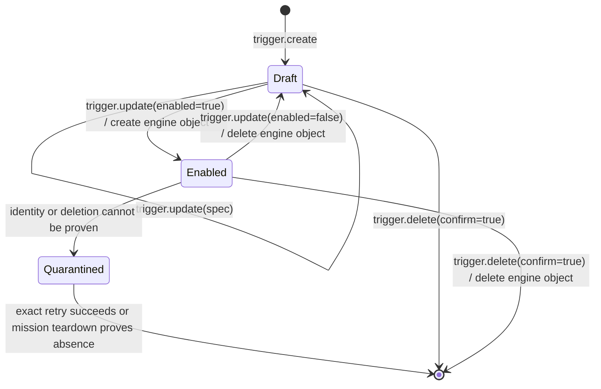
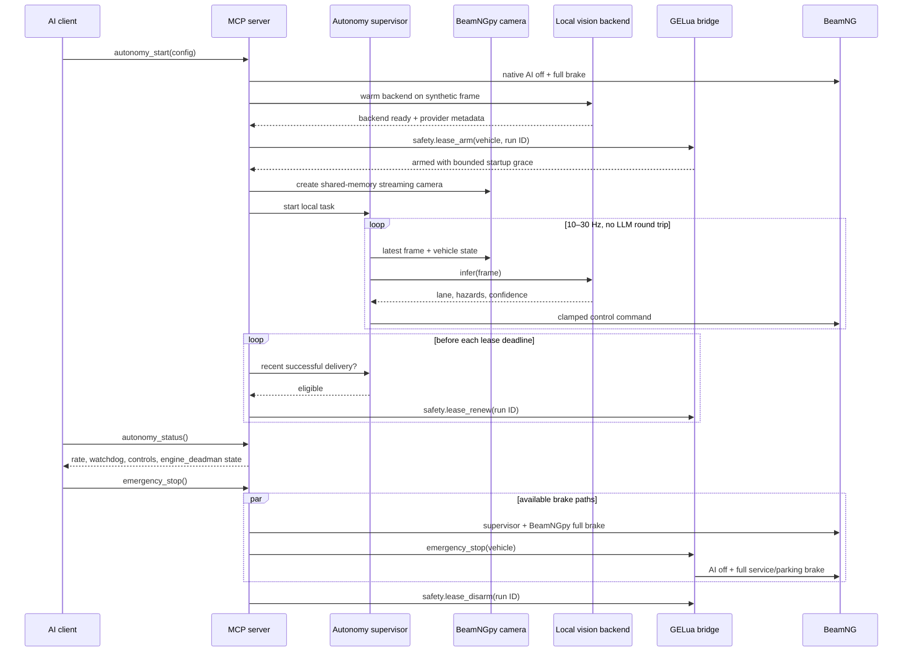

# Architecture

## Goals

BeamNG MCP gives an AI client broad simulator and content-authoring capabilities without putting
an LLM on a real-time control path or exposing a direct arbitrary-code command. Installing an
authored Lua mod is intentionally treated as code execution and remains operator-gated. The design
optimizes for one Windows workstation running BeamNG and GPU inference together.

## Components

### MCP adapter

`mcp_adapter.py` is the only package module coupled to FastMCP v1. It declares tools, resources,
prompts, structured outputs, and annotations. The rest of the application does not import the MCP
SDK. This boundary is intentional: the MCP Python SDK v2 transition can be handled here without
rewriting BeamNG, mod, or vision services.

stdio is the default transport. Streamable HTTP is opt-in, loopback-only, bearer-authenticated,
and protected by host/origin checks. WebSocket is not an MCP transport in this project.

### Process runtime

`Runtime` owns state across MCP sessions:

- one serialized BeamNGpy adapter
- one private Lua WebSocket client
- one confined mod workspace
- one process-level job manager
- one autonomy supervisor
- one engine-safety-lease state machine and renewal task

FastMCP's lifespan closes control loops, jobs, sensors, sockets, and the BeamNGpy connection.

### BeamNGpy adapter

BeamNGpy uses synchronous MessagePack sockets. All calls run on one dedicated executor thread so
tool calls do not block the MCP event loop and socket access is never concurrent. Cameras and
large sensors write bounded artifacts instead of returning massive arrays through MCP. The
autonomy path consumes camera images directly in process memory.

BeamNGpy is the primary adapter in the supported BeamNG.tech tier. Retail Drive behavior is not
part of BeamNGpy's official compatibility promise.

### GELua bridge

The custom extension owns one native loopback WebSocket server in the Game Engine Lua VM. Python
connects as a client with subprotocol `beamng-mcp-v1`. The unpacked mod's
`scripts/beamng_mcp/modScript.lua` loads the extension when the mod is activated.

The installer resolves BeamNG 0.37+'s active Windows user folder from `userFolder` in
`%LOCALAPPDATA%\BeamNG\BeamNG.drive.ini`, falling back to
`%LOCALAPPDATA%\BeamNG\BeamNG.drive\current`. This follows BeamNG's official
[third-party discovery rules](https://documentation.beamng.com/support/version/) instead of
guessing a version-named directory.

Envelope:

```json
{
  "schema": 1,
  "id": "correlation-id",
  "type": "request",
  "method": "world.get_object",
  "params": { "name": "example" },
  "token": "per-install-secret"
}
```

Responses preserve schema, ID, type, and method and contain either `result` or a structured
`error`. Events use `type: "event"`. The extension authenticates every request, expires idle peers,
limits decoded payloads and queues, and dispatches only predefined handlers. There is no handler
for direct arbitrary Lua evaluation, shell execution, filesystem access, or unrestricted extension
loading.

Native `BNGWebWSServer`/`wsUtils` bindings are shipped with BeamNG but are internal APIs. The
bridge feature-probes them and is treated as a version-specific adapter. Every BeamNG update needs
an integration smoke test.

### Engine safety lease

Every `autonomy_start` path first disables native AI and brakes the selected vehicle. Vision
backends then warm on a synthetic frame before Python creates a run-unique, vehicle-scoped lease
through authenticated GELua. The bridge resolves the vehicle before arming and grants only the
configured bounded startup grace. Native AI is renewed after a bounded vehicle-state heartbeat;
vision and hybrid runs become renewal-eligible only after a recently successful BeamNG control
delivery. Python also keeps a conservative local deadline and rejects direct autonomy controls
after authorization expires.

The bridge measures expiry with game-engine real time, independently of Python's event loop and
BeamNGpy worker. A missed renewal disables AI, sets throttle to zero, and applies full service and
parking brake to the leased vehicle. Extension unload expires an active lease the same way. The
normal stop order is: stop renewal, revoke direct-control authorization, stop/brake through Python
and GELua, then disarm. If Python dies or hangs before that sequence completes, GELua expiry is the
fail-closed path.

The authenticated-peer heartbeat and the engine lease solve different problems. Heartbeat expiry
invalidates an idle WebSocket peer; lease expiry actively brakes an automated vehicle. Neither can
run if BeamNG's own Lua update loop is frozen.

### Mod workspace

Python owns content authoring. Every path is resolved below `<workspace>/mods/<mod_name>`; absolute
paths, traversal, invalid top-level roots, and symlinks are rejected. Writes are atomic and can
require the SHA-256 observed by a prior read. Packaging places BeamNG roots directly in the zip.
Per-file, file-count, and total-byte quotas are enforced while reading, writing, validating, and
packing. Installation is disabled unless the operator sets `workspace.allow_mod_install = true`;
the MCP call must still confirm. An approved overwrite receives a timestamped backup.

Lua authored through the workspace is inert until BeamNG activates an installed package. Once
installed, it executes with the privileges of BeamNG's Lua VM. Static validation is useful QA, not
a sandbox or proof that authored code is safe.

### Blender soft-body evidence pipeline

Blender MCP and BeamNG MCP remain peer servers coordinated by the MCP client. BeamNG MCP creates a
random, expiring, single-use directory below `<workspace>/imports/<slot_id>` and writes a
version-controlled Blender helper plus a configured runner into it. The returned `AssetStage`
contains a `blender_execute_code` string; the MCP client sends that string verbatim to Blender MCP
instead of constructing code from the returned path. Blender may write only the fixed `visual.dae`
and `structure.manifest.json` outputs. The server rejects unexpected entries, links/reparse points,
expired/replayed slots, unstable reads, digest mismatches, XML entities, external Collada
references, non-Z-up/non-metre assets, and non-identity emitted scene transforms.

The reviewed Blender helper emits the raw `beamng-blender-handoff-v1` schema. The coordinator
verifies it against the exact structured handoff request plus helper and runner hashes retained in
server-session memory, then creates the canonical `beamng-structure-v1` manifest used by the pure
compiler and provenance file. A slot therefore fails closed after a server restart even if its
files remain on disk. Creation is capped; later creates prune safely verified expired and consumed
slots. These digests are consistency and replay controls, not cryptographic attestation of the
Blender process or workstation.

The Blender helper evaluates a sparse physics cage and visual mesh through the dependency graph.
It requires stable `beamng_node_id` POINT strings, records exact source object/vertex provenance,
and bakes the same explicit proper-rigid Blender-world → BeamNG-vehicle transform into both the DAE
visual and physics coordinates. Surface nodes must equal emitted DAE vertices within 1 µm; interior
nodes are explicitly tagged. Physics-cage and DAE bounds must match. The public handoff maps every
node to a contiguous evaluated vertex of one cage; it does not accept separate control-object
nodes. `asset_name` must equal `mod_name`, while the visual mesh, cage, and one material are
asset-namespaced. V1 emits one flexbody and effectively supports one structural asset per mod.

The JBeam compiler is pure and deterministic. It accepts only explicit cage edges, quad panels,
triangles, reference nodes, base nodes, and typed mechanisms. Quad panels generate both X
diagonals; it never performs nearest-neighbor topology or coordinate inference. The staged normal
beam graph must already be connected before build-time hydros, rails, or slidenodes are applied.
Because v1 has no actuator-only edge tag, its public path cannot model a disconnected moving
crusher plate: adding a normal edge would permanently connect it, while omitting one fails graph
validation. A target mass or measured closed-volume/density route is distributed across nodes
while preserving total mass and applying the reviewed base weighting. A volume-based build must
repeat the Blender-measured volume exactly. The output includes strict-JSON JBeam,
`main.materials.json`, vehicle `info.json`, `<asset>.pc`, `info_<asset>.json`, and a full canonical
provenance sidecar. Texture references are not accepted. A later validation recompiles that
sidecar and byte-compares generated files.

The DAE and all generated files are staged before a transactional multi-file replace with rollback.
For a replacement, `overwrite=true` must carry a complete `expected_sha256` map for every bundle
target that currently exists (and no entry for a target that does not). The coordinator consumes
the one-use slot before attempting the workspace commit. This prevents a retry from producing two
policy bundles from one evidence set, but it also means a commit failure requires a fresh Blender
handoff.

This proves evidence, topology, and packaging consistency only. It does not prove spawn stability,
collision quality, material tuning, or actuator behavior; those require the documented in-game
smoke sequence. BeamNG 0.38 runtime builds use DAE. glTF is diagnostic only.

### Map mutation boundaries

Objects created through the bridge are recorded with their exact engine reference, ID, name, and
class and can be updated or deleted only while all four values and both scene lookups still match.
Renames refresh that evidence; mission transitions clear it. A recycled numeric ID therefore never
inherits mutation authority from an object that disappeared in an earlier level. An identity or
lookup mismatch revokes mutation authority without deleting the evidence record: the retained,
non-authorizing tombstone continues to block bridge reload until an exact managed deletion proves
the recorded ID and name absent or a mission transition clears the level-scoped registry.
Pre-existing level objects require the independent, default-off
`workspace.allow_existing_map_object_edits` gate in both Python and installed GELua configuration.
Persistent saving has a separate `workspace.allow_persistent_map_edits` gate and requires both
`confirm=true` and the exact currently loaded level identifier. These controls prevent an untrusted
model from converting an advisory confirmation flag into operator authorization.

### Typed trigger lifecycle

BeamNG's [BeamNGTrigger reference](https://documentation.beamng.com/modding/levels/level_classes/beamngtrigger/)
defines the underlying volume, mode, test, callback, and tick fields. `BeamNGTrigger` is
deliberately absent from this project's generic scene-object class and field allowlists.
Trigger callback and command fields are executable or globally observable engine surfaces, and a
caller-chosen trigger name could collide with mission, career, or gameplay listeners.

The dedicated trigger protocol therefore uses a two-state lifecycle:



The bridge owns each opaque handle, derives a reserved engine name, records the exact object
reference/ID/name/class and bridge generation, and sets `canSave=false`. Disabled means no engine
object exists; this is required because BeamNG 0.38.6 has no supported universal trigger
enable/disable API. Enabled geometry is immutable. Peer disconnect or authentication expiry,
mission transitions, and extension unload normally delete both live objects and drafts.

Cleanup is fail-closed under exceptional engine identity tampering or deletion failure. The bridge
does not drop a possibly live trigger's registry entry: it removes the owner, suppresses every
callback, and preserves the exact object reference, ID, reserved name, class, and generation for a
later cleanup retry. Bulk cleanup likewise retains failed quarantine records. A mission teardown
may retire that evidence only after independent ID and name lookups both prove the object absent.
Retained quarantines remain in the registry and consume the global 64-trigger cap in addition to
the normal 32-trigger per-peer cap, preventing cleanup failures from opening an unbounded-retention
path.
An explicit bridge-extension reload is rejected while any bridge-managed scene record remains,
including generic map objects, trigger drafts, live triggers, and quarantines. Once reload is
scheduled, every scene mutation is rejected and both registries are checked again at the final
unload boundary. This closes the same-event-batch window and prevents reload from discarding
authorization, ownership, or cleanup evidence that the bridge has not proved safe to release.
This guarantee covers reloads requested through the MCP API. A manual forced unload through the
BeamNG console or extension manager remains unsafe: exact generic-object authorization is lost,
and although `onExtensionUnloaded` attempts trigger cleanup, module-local quarantine evidence
cannot survive if BeamNG proceeds with unloading after a cleanup failure. Operators must not
force-unload the bridge while managed scene records remain.

V1 creates only Box triggers, fixes `luaFunction` to `onBeamNGTrigger`, disables ticking, and
supports only a typed event-emission action. The callback ignores all non-owned trigger traffic,
revalidates the exact live object and real vehicle subject, copies only bounded enter/exit scalar
fields, and emits only to the authenticated owner. Python also requires each requested trigger
method to appear among the five bridge trigger methods in the capability response before sending
that request, so an upgraded MCP server cannot mutate through a stale installed extension.
Enablement commits only after the bridge reads back finite position, rotation, and scale values
that match the requested collision volume within float-safe tolerances; quaternion sign inversion
is accepted because `q` and `-q` represent the same rotation.
Once a trigger mutation send begins, a response timeout or caller cancellation makes its outcome
uncertain. The client closes that exact WebSocket before propagating the failure, invoking the
bridge's peer-disconnect cleanup instead of leaving an unobserved draft or live trigger behind.

The local HavocNG transcript corpus informed adversarial cases such as rotated/thin volumes,
terrain overlap, spheres, moving triggers, and raw command fields. It is test inspiration rather
than API authority: several videos target older builds or use unrestricted Lua and shipped-archive
editing, so those techniques are intentionally not reproduced by this protocol.

### Vision and control

The real-time subsystem is SDK-independent and uses injected interfaces:

```text
AsyncFrameSource → PerceptionBackend → DrivingController → AsyncControlSink
                            ↘ metrics/watchdog ↗
```

The frame source reads BeamNGpy shared-memory camera output and vehicle state. Perception runs in
a worker thread. The controller combines lane centering with confidence, curvature, and hazard
speed constraints. A separate watchdog task can issue emergency braking while frame acquisition or
inference is stalled.

## Control sequence

This sequence shows a vision or hybrid run; native AI uses the same arm/renew/disarm boundary but
does not run the camera/model loop.



## Capability split

The bridge and BeamNGpy are complementary, not redundant:

- BeamNGpy: supported simulation lifecycle, deterministic stepping, scenarios, vehicles, native
  AI, traffic, environment, roads, and high-bandwidth sensors.
- GELua: retail Drive fallback, asynchronous telemetry, editor/scene mutations, an engine-real-time
  autonomy lease, and an independent emergency-stop path.
- Python workspace: mod content and packages, avoiding unstable internal mod-manager APIs.
- Blender peer: reviewed, version-controlled extraction/export code through a one-use file handoff;
  never a direct MCP-to-MCP trust escalation.

## Trust boundaries

| Boundary | Controls |
| --- | --- |
| AI client → MCP | typed schemas, curated tools, destructive hints, confirmations |
| HTTP → MCP | loopback bind, bearer auth, Host/Origin checks, body limits inherited from SDK |
| Python → BeamNGpy | loopback only, one serialized connection, no arbitrary command or raw queue tool |
| Python → GELua | loopback, shared token, allowlist, correlation IDs, heartbeat, bounded queues, typed loss-aware trigger event pages, vehicle-scoped lease |
| AI → filesystem | one canonical workspace, quotas, no symlinks/traversal, atomic writes, hashes/backups, default-off install |
| Blender → mod compiler | capped expiring fixed-name inbox, session-bound request/helper/runner hashes, exact cage-vertex provenance, explicit rigid transform, DAE parser, pre-commit one-use consume |
| AI → map | managed objects by default; separate existing-object and exact-level save gates |
| Model → actuation | clamps, speed governor, stale-frame/command watchdog, engine lease, emergency brake |

Blender MCP 1.6.4's loopback execute-code interface is unauthenticated, grants full code execution
inside Blender, and may capture executed-code telemetry. For private assets, set
`BLENDER_MCP_DISABLE_TELEMETRY=1` before starting Blender MCP. Loopback binding and handoff hashes
reduce accidental exposure and detect inconsistent artifacts; they do not turn Blender MCP into a
sandbox or attest the exporter execution cryptographically.

## Failure behavior

- Missing camera frame: full brake.
- Stale frame after inference: full brake.
- Repeated perception failure: supervisor enters failed state and brakes.
- Engine lease cannot arm: autonomy start aborts and both BeamNGpy and GELua braking are attempted.
- Control sink or lease-renewal failure: control authorization is revoked, the supervisor stops,
  GELua braking is requested, and engine-side expiry remains fail-closed.
- Python process or event loop stalls: renewal stops; GELua expires the lease and brakes while the
  game engine remains responsive.
- MCP client disconnect: real-time loop keeps its own lifecycle, but an explicit stop or server
  shutdown brakes and tears it down.
- Lua heartbeat loss: peer authentication expires; an armed vehicle lease has its own shorter
  real-time expiry.
- Simulator disconnect: sensor cleanup is attempted and autonomy stops.
- Invalid Blender evidence discovered before build: no mod files are written and the handoff stays
  available until expiry. Once a valid build reaches commit, the handoff is consumed first; any
  later commit failure requires a fresh export.

## Deliberate non-features

- No direct arbitrary Lua-eval, Python, or shell tool. Installing an authored Lua mod is a separate,
  explicit code-execution boundary and is disabled by default.
- No generic unrestricted file reader/writer.
- No arbitrary Blender source path, prompt-authored JBeam coordinate, inferred nearest-neighbor
  cage, or fictional JBeam `hinges` section.
- No v1 external textures, multiple visual meshes/materials/flexbodies, multiple structural assets
  in one mod, separate control-object nodes, or disconnected moving subassemblies.
- No video streaming through MCP or JSON WebSocket.
- No LLM sampling inside the driving loop.
- No dependency on experimental MCP Tasks; jobs are application-level records.
- No redistribution of BeamNG assets.
