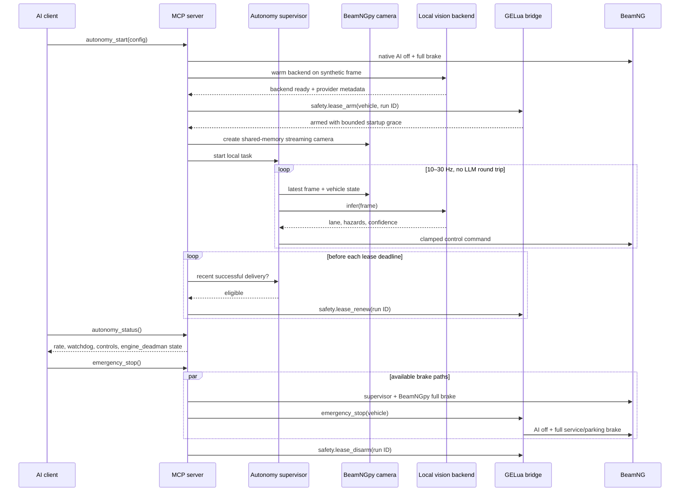

# Architecture

## Goals

BeamNG MCP gives an AI client broad simulator and content-authoring capabilities without putting
an LLM on a real-time control path or exposing a direct arbitrary-code command. Installing an
authored Lua mod is intentionally treated as code execution and remains operator-gated. The design
optimizes for one Windows workstation running BeamNG and GPU inference together.

## Components

### MCP adapter

`mcp_adapter.py` is the only package module coupled to FastMCP v1. It declares tools, resources,
prompts, structured outputs, and annotations. The rest of the application does not import the MCP
SDK. This boundary is intentional: the MCP Python SDK v2 transition can be handled here without
rewriting BeamNG, mod, or vision services.

stdio is the default transport. Streamable HTTP is opt-in, loopback-only, bearer-authenticated,
and protected by host/origin checks. WebSocket is not an MCP transport in this project.

### Process runtime

`Runtime` owns state across MCP sessions:

- one serialized BeamNGpy adapter
- one private Lua WebSocket client
- one confined mod workspace
- one process-level job manager
- one autonomy supervisor
- one engine-safety-lease state machine and renewal task

FastMCP's lifespan closes control loops, jobs, sensors, sockets, and the BeamNGpy connection.

### BeamNGpy adapter

BeamNGpy uses synchronous MessagePack sockets. All calls run on one dedicated executor thread so
tool calls do not block the MCP event loop and socket access is never concurrent. Cameras and
large sensors write bounded artifacts instead of returning massive arrays through MCP. The
autonomy path consumes camera images directly in process memory.

BeamNGpy is the primary adapter in the supported BeamNG.tech tier. Retail Drive behavior is not
part of BeamNGpy's official compatibility promise.

### GELua bridge

The custom extension owns one native loopback WebSocket server in the Game Engine Lua VM. Python
connects as a client with subprotocol `beamng-mcp-v1`. The unpacked mod's
`scripts/beamng_mcp/modScript.lua` loads the extension when the mod is activated.

The installer resolves BeamNG 0.37+'s active Windows user folder from `userFolder` in
`%LOCALAPPDATA%\BeamNG\BeamNG.drive.ini`, falling back to
`%LOCALAPPDATA%\BeamNG\BeamNG.drive\current`. This follows BeamNG's official
[third-party discovery rules](https://documentation.beamng.com/support/version/) instead of
guessing a version-named directory.

Envelope:

```json
{
  "schema": 1,
  "id": "correlation-id",
  "type": "request",
  "method": "world.get_object",
  "params": { "name": "example" },
  "token": "per-install-secret"
}
```

Responses preserve schema, ID, type, and method and contain either `result` or a structured
`error`. Events use `type: "event"`. The extension authenticates every request, expires idle peers,
limits decoded payloads and queues, and dispatches only predefined handlers. There is no handler
for direct arbitrary Lua evaluation, shell execution, filesystem access, or unrestricted extension
loading.

Native `BNGWebWSServer`/`wsUtils` bindings are shipped with BeamNG but are internal APIs. The
bridge feature-probes them and is treated as a version-specific adapter. Every BeamNG update needs
an integration smoke test.

### Engine safety lease

Every `autonomy_start` path first disables native AI and brakes the selected vehicle. Vision
backends then warm on a synthetic frame before Python creates a run-unique, vehicle-scoped lease
through authenticated GELua. The bridge resolves the vehicle before arming and grants only the
configured bounded startup grace. Native AI is renewed after a bounded vehicle-state heartbeat;
vision and hybrid runs become renewal-eligible only after a recently successful BeamNG control
delivery. Python also keeps a conservative local deadline and rejects direct autonomy controls
after authorization expires.

The bridge measures expiry with game-engine real time, independently of Python's event loop and
BeamNGpy worker. A missed renewal disables AI, sets throttle to zero, and applies full service and
parking brake to the leased vehicle. Extension unload expires an active lease the same way. The
normal stop order is: stop renewal, revoke direct-control authorization, stop/brake through Python
and GELua, then disarm. If Python dies or hangs before that sequence completes, GELua expiry is the
fail-closed path.

The authenticated-peer heartbeat and the engine lease solve different problems. Heartbeat expiry
invalidates an idle WebSocket peer; lease expiry actively brakes an automated vehicle. Neither can
run if BeamNG's own Lua update loop is frozen.

### Mod workspace

Python owns content authoring. Every path is resolved below `<workspace>/mods/<mod_name>`; absolute
paths, traversal, invalid top-level roots, and symlinks are rejected. Writes are atomic and can
require the SHA-256 observed by a prior read. Packaging places BeamNG roots directly in the zip.
Per-file, file-count, and total-byte quotas are enforced while reading, writing, validating, and
packing. Installation is disabled unless the operator sets `workspace.allow_mod_install = true`;
the MCP call must still confirm. An approved overwrite receives a timestamped backup.

Lua authored through the workspace is inert until BeamNG activates an installed package. Once
installed, it executes with the privileges of BeamNG's Lua VM. Static validation is useful QA, not
a sandbox or proof that authored code is safe.

### Map mutation boundaries

Objects created through the bridge are recorded as bridge-managed and can be updated or deleted.
Pre-existing level objects require the independent, default-off
`workspace.allow_existing_map_object_edits` gate in both Python and installed GELua configuration.
Persistent saving has a separate `workspace.allow_persistent_map_edits` gate and requires both
`confirm=true` and the exact currently loaded level identifier. These controls prevent an untrusted
model from converting an advisory confirmation flag into operator authorization.

### Vision and control

The real-time subsystem is SDK-independent and uses injected interfaces:

```text
AsyncFrameSource → PerceptionBackend → DrivingController → AsyncControlSink
                            ↘ metrics/watchdog ↗
```

The frame source reads BeamNGpy shared-memory camera output and vehicle state. Perception runs in
a worker thread. The controller combines lane centering with confidence, curvature, and hazard
speed constraints. A separate watchdog task can issue emergency braking while frame acquisition or
inference is stalled.

## Control sequence

This sequence shows a vision or hybrid run; native AI uses the same arm/renew/disarm boundary but
does not run the camera/model loop.



## Capability split

The bridge and BeamNGpy are complementary, not redundant:

- BeamNGpy: supported simulation lifecycle, deterministic stepping, scenarios, vehicles, native
  AI, traffic, environment, roads, and high-bandwidth sensors.
- GELua: retail Drive fallback, asynchronous telemetry, editor/scene mutations, an engine-real-time
  autonomy lease, and an independent emergency-stop path.
- Python workspace: mod content and packages, avoiding unstable internal mod-manager APIs.

## Trust boundaries

| Boundary | Controls |
| --- | --- |
| AI client → MCP | typed schemas, curated tools, destructive hints, confirmations |
| HTTP → MCP | loopback bind, bearer auth, Host/Origin checks, body limits inherited from SDK |
| Python → BeamNGpy | loopback only, one serialized connection, no exposed Lua queue tool |
| Python → GELua | loopback, shared token, allowlist, correlation IDs, heartbeat, bounded queues, vehicle-scoped lease |
| AI → filesystem | one canonical workspace, quotas, no symlinks/traversal, atomic writes, hashes/backups, default-off install |
| AI → map | managed objects by default; separate existing-object and exact-level save gates |
| Model → actuation | clamps, speed governor, stale-frame/command watchdog, engine lease, emergency brake |

## Failure behavior

- Missing camera frame: full brake.
- Stale frame after inference: full brake.
- Repeated perception failure: supervisor enters failed state and brakes.
- Engine lease cannot arm: autonomy start aborts and both BeamNGpy and GELua braking are attempted.
- Control sink or lease-renewal failure: control authorization is revoked, the supervisor stops,
  GELua braking is requested, and engine-side expiry remains fail-closed.
- Python process or event loop stalls: renewal stops; GELua expires the lease and brakes while the
  game engine remains responsive.
- MCP client disconnect: real-time loop keeps its own lifecycle, but an explicit stop or server
  shutdown brakes and tears it down.
- Lua heartbeat loss: peer authentication expires; an armed vehicle lease has its own shorter
  real-time expiry.
- Simulator disconnect: sensor cleanup is attempted and autonomy stops.

## Deliberate non-features

- No direct arbitrary Lua-eval, Python, or shell tool. Installing an authored Lua mod is a separate,
  explicit code-execution boundary and is disabled by default.
- No generic unrestricted file reader/writer.
- No video streaming through MCP or JSON WebSocket.
- No LLM sampling inside the driving loop.
- No dependency on experimental MCP Tasks; jobs are application-level records.
- No redistribution of BeamNG assets.
