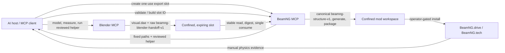

# Soft-Body Authoring with Blender and BeamNG MCP

This guide defines the repeatable workflow for creating a visual model in Blender and turning it
into a functional BeamNG soft-body prop. It applies to objects such as ramps, barriers, pendulums,
gates, rollers, and hydraulic machinery that fits the v1 connected-cage boundary documented below.

The central rule is simple: **every coordinate accepted through the public MCP handoff must come
from an exact evaluated vertex of the named Blender physics cage**. A plausible-looking coordinate,
prompt-authored point, or separate control object is not public-v1 evidence.

This is an authoring workflow, not a promise that static validation proves a mod safe or physically
correct. Final acceptance requires an operator-reviewed, in-game smoke test in disposable content.

## Capability boundary

The Blender and BeamNG servers are peer MCP servers. They do not call each other. The MCP host or
AI client coordinates the calls, while the artifact and raw evidence move through the confined
slot; the client gives BeamNG MCP only the opaque slot ID.



The handoff must be explicit:

1. BeamNG MCP creates a random, expiring, one-use slot for one `mod_name`, `asset_name`, and visual
   format. It returns absolute fixed paths, places the versioned reviewed helper
   `beamng_softbody_export.py` plus `run_export.py` in that slot, and returns a
   `blender_execute_code` string.
2. Through Blender MCP, the host executes the returned `blender_execute_code` **verbatim**. Do not
   reconstruct code from `blender_runner_path`, retype the path, or substitute another helper. The
   reviewed helper evaluates the dependency graph, computes
   `(evaluated_object.matrix_world @ vertex.co)`, and writes exactly `structure.manifest.json` and
   `visual.dae` to the returned paths. Save the source `.blend` separately; it is not a runtime
   asset.
3. The host gives BeamNG MCP the opaque slot ID, not an arbitrary file path. BeamNG MCP rejects an
   expired or previously consumed slot, missing or unexpected entries, links/reparse points, and
   unstable reads. It binds the final bytes by size and SHA-256.
4. BeamNG MCP validates the raw `beamng-blender-handoff-v1` document and DAE, converts the evidence
   into canonical `beamng-structure-v1`, and applies mass and mechanism policy. It consumes the slot
   immediately before attempting the transactional bundle commit. If that commit fails, the slot
   remains consumed and the workflow needs a fresh Blender export.
5. Packaging, installation, activation, and in-game execution remain separate actions. Installation
   is operator gated.

The slot also contains `stage.json`, which is owned by BeamNG MCP. Blender must not modify it or add
scratch files. The exact structured handoff request and the helper and runner hashes are retained
in the current BeamNG MCP process, outside the writable slot. A restart invalidates every
outstanding slot even if its directory survives. Slot count is capped, and later creation prunes
safely verified expired and consumed slots. A glTF slot may be used for diagnostic interchange,
but the v1 JBeam build contract and BeamNG 0.38 runtime package require DAE.

Do not expose either server's arbitrary Python, Lua, shell, or unrestricted file capabilities as a
shortcut. Blender-side scripting is limited to the Blender process; authored vehicle Lua becomes
code execution when BeamNG loads the installed mod.

The installed Blender MCP (`blender-mcp==1.6.4`) exposes unrestricted `execute_blender_code` over
an unauthenticated loopback TCP bridge (`127.0.0.1:9876`) and may capture executed-code telemetry.
Treat that as full-trust local code execution: keep it on loopback, use only the returned reviewed
code, and set `BLENDER_MCP_DISABLE_TELEMETRY=1` before launching Blender MCP for private assets or
paths. `get_object_info` reports bounds and mesh counts but not the per-vertex evidence required by
this workflow, so it is not a substitute for evaluated extraction. Slot hashes provide consistency
and replay evidence; they are not cryptographic attestation of Blender, its add-on, or the host.

## Deliverables

A standalone soft-body prop uses BeamNG's vehicle/JBeam loader even when it is not drivable. The
v1 coordinator generates this vehicle layout:

```text
vehicles/
└── <unique_mod_id>/
    ├── <unique_mod_id>.jbeam
    ├── <unique_mod_id>.dae
    ├── main.materials.json
    ├── info.json
    ├── <unique_mod_id>.pc
    ├── info_<unique_mod_id>.json
    └── <unique_mod_id>.structure.json
```

The `.structure.json` file is compiler provenance: coordinate contract, source manifest digest,
DAE evidence, material-catalog version, build summary, and generated output hashes. It is not a
BeamNG runtime requirement, but it should remain in the package for auditability.

The generated `.pc` and `info_<unique_mod_id>.json` form the default named configuration selected
by `info.json`. The v1 coordinator does not stage texture images and rejects DAE image references.
Do not add a selector preview, textures, extra configurations, controllers, Lua, or input actions
and still claim that `softbody_mod_validate` covers them; those require a separately reviewed
manual extension outside this deterministic bundle.

`mod_info.json` is not a standalone-prop runtime requirement. BeamNG 0.38's shipped vehicle and
prop packages use `vehicles/<id>/info.json`, for example:

```json
{
  "Name": "Concrete Ramp",
  "Author": "Your Name",
  "Type": "Prop",
  "default_pc": "concrete_ramp"
}
```

The packed ZIP must open directly onto `vehicles/` and any other valid BeamNG roots. It must not
contain an extra `<mod_name>/vehicles/` wrapper. Public v1 requires `asset_name == mod_name`; use
one unique, lowercase snake-case identifier. The visual mesh, physics cage, and material name must
equal that identifier or start with `<asset_name>_`. Do not claim `BeamNG` as the author because
that name is reserved for official content.

## Raw handoff and canonical build contracts

There are two distinct schemas:

- `beamng-blender-handoff-v1` is the raw `structure.manifest.json` written by the reviewed Blender
  helper into the fixed slot. It contains the asset/object identities, exact evaluated cage
  vertices, roles, mesh edges, brace panels, triangles, bounds, measured closed volume, transform,
  visual digest, and helper generator identity. The client supplies only the slot ID; it never
  submits or edits this document as an MCP argument.
- `beamng-structure-v1` is the canonical internal compiler manifest created by BeamNG MCP after the
  raw document, DAE, request binding, and helper/runner hashes pass validation. It is embedded in
  `<asset>.structure.json` and drives deterministic rebuild validation.

Neither schema is a prompt summary, and neither permits the coordinator to infer geometry from
prose. The canonical contract rejects extra fields; its persisted shape is:

| Field | Required evidence |
| --- | --- |
| `schema` | Literal `beamng-structure-v1` (created server-side from the raw handoff) |
| `mod_name`, `part_name`, `display_name`, `author` | Stable package and part identity |
| `coordinates` | Units/spaces, applied-transform assertion, source origin, 4×4 conversion matrix, `tolerance_m` |
| `bounds` | BeamNG-vehicle-space minimum and maximum |
| `visual` | Relative `.dae` path, SHA-256, byte size, mesh/material names, and DAE bounds |
| `material` | `steel`, `concrete`, `wood`, or `rubber` preset plus visual material values |
| `mass` | Either explicit `total_mass_kg` or `closed_volume_m3` with optional density override |
| `nodes` | Blender cage object/vertex evidence, source and BeamNG positions, group, surface flag, and mass scale |
| `edges` | Explicit endpoints plus optional spring/damp/deform/strength scales |
| `brace_panels` | Four ordered, distinct corners for each explicit X-braced panel |
| `triangles` | Three distinct node IDs and an optional allowlisted ground model |
| `refnodes` | Distinct `ref`, `back`, `left`, and `up` IDs |
| `base` | `free`, `weighted`, or `fixed` policy, base node IDs, and mass multiplier |
| `hydros`, `rails`, `slidenodes` | Bounded mechanism definitions; empty when not used |

The canonical coordinate declaration is deliberately fixed to `metres`, `blender_world`,
`beamng_vehicle`, source `+Z`, and target `+X left, +Y backward, +Z up`. It must assert
`transforms_applied: true`. `tolerance_m` is positive and no greater than `0.000001` m.

### Coordinate evidence

Every structural node records `source_object`, `source_vertex_index`, `source_world_position`,
`beamng_position`, and a group. In the public MCP path, every node—surface or interior—must be one
evaluated vertex of the single named cage, and the source indices must be exactly
`0..node_count-1`; raw node row `i` must cite evaluated source vertex `i`. Although the pure
canonical model can represent non-surface provenance more
generally, the public raw-to-canonical coordinator does not accept separate Blender control
objects.

If a midpoint, centroid, projected rail point, bounding-box corner, pivot, or offset is needed,
model it as an actual vertex in the physics cage and assign a stable `beamng_node_id`. Mark it
`beamng_interior` when it should not have to coincide with a DAE surface vertex. An LLM-authored
decimal or separate empty/control object is invalid. “Approximately at the corner” is also invalid.

Evidence must also satisfy these rules:

- Coordinates and mass values are finite numbers, not NaN or infinity.
- Node IDs are unique within the single compiled structure.
- Every beam, triangle, rail, and actuator references defined node IDs.
- The transform and bounds use full precision. Rounding is allowed only for emitted presentation,
  after the error remains inside the declared tolerance.
- A DAE digest or post-export geometry check binds the evidence to the artifact being packaged.
- A changed mesh, applied transform, export profile, or DAE invalidates the old evidence.

`mass_scale` on nodes is positive and bounded; it expresses relative distribution before the
compiler normalizes the weights to the target mass. Weighted and fixed base policies require at
least three unique base nodes and a multiplier of at least two. A free base has no base IDs and a
multiplier of exactly one.

Static validation can prove that evidence is internally consistent. It cannot prove that the chosen
physics topology is stable in BeamNG.

## Coordinate systems and calibration

BeamNG vehicle space is Z-up and uses SI units:

| Axis | Positive vehicle-space direction |
| --- | --- |
| `+X` | left |
| `+Y` | rearward |
| `+Z` | up |

Forward is `-Y`, not `+X`. World/map space is also Z-up but is fixed to the level. JBeam node
coordinates are vehicle-local and must not include the vehicle's eventual map spawn transform.

Blender's current modeling guidance describes the visual front as Blender `+Y`, while BeamNG's
JBeam documentation defines vehicle forward as `-Y`. Exporters may also bake orientation into
vertices. Therefore this workflow never assumes that Blender world coordinates equal JBeam
coordinates and never hard-codes a sign flip based only on prose.

### Calibrate before authoring coordinates

For each Blender version and exporter implementation:

1. Set scene units to meters and preserve Z-up authoring.
2. Create a deliberately asymmetric calibration object with a known origin and at least four
   non-coplanar named points. Give `+X`, `+Y`, and `+Z` markers different distances so axis swaps
   and reflections cannot appear valid accidentally.
3. Apply the same transforms and export profile intended for the real asset.
4. Parse or re-import the emitted geometry and derive the Blender-world-to-BeamNG-vehicle **proper
   rigid transform**. Scale belongs in the authored metric scene and exported vertices, not in this
   matrix.
5. Put the 4×4 matrix and accepted tolerance in the structured `softbody_handoff_create` request.
   The helper repeats it in `beamng-blender-handoff-v1`, and the coordinator binds it into
   `beamng-structure-v1`. Keep the calibration inputs, exporter identity/version, and observed
   residual in the external build record.
6. Require the residual to be within the declared coordinate tolerance before modeling proceeds.
7. Apply the transform to every evaluated landmark and verify the resulting bounds against the
   emitted artifact.

The compiler rejects scale, shear, and reflection: the rotation rows must be unit length and
mutually orthogonal, the determinant must be `+1`, the homogeneous last row must be
`[0, 0, 0, 1]`, and `source_origin_world` must map to `(0, 0, 0)`. The calibrated route must also
preserve Blender/BeamNG `+Z` as up. Do not use a reflection merely to turn Blender visual-forward
`+Y` into vehicle-forward `-Y`; use a proper rotation and verify the asymmetric calibration object.

For a Blender object and local vertex `v`, the measured authoring coordinate is the evaluated
world-space value:

```text
p_blender_world = evaluated_object.matrix_world @ v.co
p_vehicle       = T_blender_to_vehicle @ p_blender_world
```

Use the evaluated dependency graph so modifier output, not the unevaluated source cage, is measured
when the modifier is part of the runtime visual. Apply object scale and rotation before final
export; flexbody mesh origins should be at `(0, 0, 0)`, rotations at zero, and scales at one.

Recalibrate when any of the following changes:

- Blender version;
- DAE exporter or exporter add-on version;
- export axis, unit, modifier, or transform settings;
- an intermediate conversion program; or
- the scene origin or collection transform.

### Capability-tested Blender runtime

Blender installations and their user/add-on profiles are version-specific and can coexist. The
validated Windows reference uses portable Blender 4.5.4 LTS with the Blender MCP 1.6.4 add-on
enabled in its 4.5 profile. The live active-profile probe reports Blender 4.5.4,
`wm.collada_export`, selection-only support, and a glTF operator with every deterministic option;
separate factory-startup fixtures verify identity/transformed DAE bounds and the active-profile
fixture verifies Blender MCP registration.
Blender 5.2 remains useful for unrelated work, but its stock runtime is not the validated DAE route.

Configure the exact executable instead of making a version-only assumption:

```toml
[blender]
executable = "C:/Users/you/Applications/Blender/4.5.4/blender.exe"
probe_timeout_seconds = 20.0
```

`beamng-mcp doctor --json` briefly runs that binary with `--background`, loading its active
user/add-on profile, and requires exactly one DAE export operator with a selection-only property.
This prevents an extra profile exporter from being hidden by a factory-startup probe. Its
`gltf_export` flag additionally requires `filepath`, `export_format`, `use_selection`, and
`export_yup`, exactly matching the reviewed helper. An installed Blender MCP Python package does
not prove that Blender is connected or that its add-on is enabled in this profile. Conversely,
Blender MCP registration does not prove that a compatible DAE exporter is present. With no
explicit executable, common side-by-side candidates are probed until one is compatible; an
explicit path probes only that requested runtime. Run both reference checks from
[Development](DEVELOPMENT.md). The supplied factory-startup export fixture validates the built-in
`wm.collada_export` route only; an add-on exporter requires an equivalent active-profile fixture
with a reviewed expected operator.

Do not rename a glTF file to `.dae`, package glTF as if it were verified, or silently use an
unreviewed converter. Any alternate exporter/runtime becomes part of the calibrated toolchain:
record it, compare emitted DAE landmarks and bounds, and run the in-game visual/material smoke.
Until a route passes the capability probe, known-fixture export, DAE inspection, and BeamNG smoke,
the workflow must stop at an export-blocked state; a `.blend` or glTF intermediate is not a
complete BeamNG mod.

### Transcript-informed workflow boundary

The reviewed HavocNG tutorial transcripts reinforce a distinction that this coordinator enforces:
visual animation and physics collision are different systems. A DAE animation or animated scene
prop is not a substitute for a JBeam skeleton. Any functional moving/contact surface—crusher
plate, gate, pendulum, roller, or ramp mechanism—must receive evidenced JBeam nodes, beams,
collision triangles, and supported actuators. Static non-deforming level geometry belongs to a
separate TSStatic/Visible Mesh workflow, which v1 does not author.

Tutorial shortcuts that modify shipped archives are also intentionally excluded. Never edit or
repack BeamNG's installed `content/*.zip` files; build under the confined workspace and install an
unpacked/ZIP overlay only into a disposable or operator-selected user folder. External GLTF/model
marketplace assets require independent source, license, attribution, texture, and conversion
provenance. V1's textureless single-material handoff does not ingest or preserve that metadata, so
such assets must not be treated as ready inputs merely because Blender can import them.

## Phase 0: Define the engineering brief

Before invoking Blender, make the physical intent explicit:

- stable mod ID and display name;
- overall dimensions and visual reference;
- material, density, fill fraction, and target mass;
- movable versus permanently anchored behavior;
- expected impacts, deformation, and breakage;
- moving components and their degrees of freedom;
- actuation source, range, speed, neutral behavior, and end stops;
- desired spawn orientation and ground contact plane; and
- acceptance tests and safety limits.

A “concrete ramp” can mean a movable multi-tonne prop, a permanently anchored prop, or a static map
mesh. Only the first two belong in this soft-body/JBeam workflow. A non-deforming world object
should instead use the level/TSStatic asset workflow.

## Phase 1: Visual model and structural evidence in Blender MCP

### 1. Build the visual shell

Create an optimized render mesh at real-world scale. Keep the silhouette and visible contact
surfaces accurate without converting every decorative edge into physics topology.

- Set `asset_name` equal to `mod_name`. Name the single visual mesh, single physics cage, and
  single material either exactly `<asset_name>` or with the `<asset_name>_` prefix.
- Give the visual mesh exactly one material and do not use image textures.
- Keep the ground contact plane and shared asset origin explicit.
- Do not split runtime components into several source objects in this public v1 path. It emits one
  visual mesh/flexbody and one connected cage, so independently moving or detachable multi-body
  assemblies require a future schema or a separately reviewed manual workflow.
- Keep flexbody objects watertight where an inside surface will become visible.
- Triangulate deterministically before or during DAE export; BeamNG's renderer consumes triangles.
- Do not use a Blender armature as the BeamNG physics rig. BeamNG deformation and mechanism motion
  come from JBeam and vehicle logic.

In JBeam terminology, a standalone physics “prop” is rendered with `flexbodies`. The JBeam `props`
section instead describes non-deforming animated visual pieces such as gauges and pedals.

The v1 compiler emits one `flexbodies` entry using `visual.mesh_name` and the one declared node
group. Join the reviewed runtime shell into that one named DAE mesh before export. The public
coordinator also requires `asset_name == mod_name`, so multiple evidenced builds cannot be used to
accumulate several structural assets inside one mod.

### 2. Build a sparse physics cage

Create one separate non-rendering physics cage in the same calibrated scene. The cage should
describe the load paths and collision envelope, not duplicate the render mesh. Every evaluated cage
vertex becomes a JBeam node and must carry a unique `beamng_node_id` POINT-string attribute. Roles,
pivots, rail endpoints, actuator endpoints, and interior rigidifiers are all cage vertices; the raw
MCP handoff does not read separate control objects.

For a box-like component, include:

- surface and corner nodes on important collision boundaries;
- intermediate nodes where a long unsupported edge or surface would be inaccurate;
- explicit face diagonals and three-dimensional braces;
- mechanism pivots, rail endpoints, actuator endpoints, and end-stop landmarks; and
- reference-frame and base landmarks.

Edges alone are not rigid: normal beams rotate freely about their nodes. A rectangular cell without
diagonals becomes a mechanism. Record every intended brace explicitly in the evidence instead of
assuming a generator will infer “all useful diagonals.” For a volume, face X-bracing alone may
still permit undesirable three-dimensional shear; add body diagonals or decompose the cage into
tetrahedral load paths.

Crossing beams do not form a joint unless a cage vertex exists at the crossing. Add a center vertex
only when the design needs that connection.

The normal edge/X-brace graph must connect every cage vertex before build-time mechanisms are
added. Hydros, rails, and slidenodes do not satisfy this connectivity check, and v1 has no
actuator-only edge classification. A disconnected crusher plate therefore cannot be represented
faithfully by the public path: omitting a normal edge fails validation, while adding one creates a
permanent structural beam. Model a single connected mechanism that the schema can express, use a
separately reviewed manual JBeam workflow, or wait for the planned multi-body schema.

### 3. Define the reference frame and base

Every assembled standalone prop must contain one valid `refNodes` set:

```json
"refNodes": [
  ["ref:", "back:", "left:", "up:"],
  ["ref", "back", "left", "up"]
]
```

The `back`, `left`, and `up` nodes must be aligned from `ref` along vehicle `+Y`, `+X`, and `+Z`
respectively. In the v1 contract they are ordinary evidenced nodes and must be connected into the
structure; it does not expose arbitrary per-node collision overrides. Misaligned or degenerate
reference nodes cause camera, orientation, and spawning failures.

For every ground-standing prop, allocate intentionally heavy, low base nodes and brace them to the
upper structure. Preserve the target total mass while lowering the center of mass; “heavy base” is
not permission to add arbitrary mass.

If the object must be immovable, identify at least three non-collinear minimum-Z base nodes as fixed
anchors and brace the upper body to them. The compiler emits those fixed nodes as non-colliding, so
other dynamic nodes must still cover the collision exterior. `fixed:true` is the actual ground
anchor. A movable prop must not receive fixed nodes merely to hide an unstable design.

### 4. Measure and export evidence

After applying final transforms:

1. Evaluate every physics-cage vertex in Blender world space.
2. Transform it with the calibrated Blender-to-vehicle matrix.
3. Compute the emitted BeamNG-space bounding box and dimensions.
4. Record node, brace, surface-triangle, material, and mechanism evidence.
5. Save the `.blend` as a source artifact outside the runtime package.
6. Export the selected runtime collection through the calibrated DAE route.
7. Parse or re-import the DAE and compare landmarks, object names, material slots, units, and
   bounds before handing the artifact to BeamNG MCP.

Use the repository-reviewed Blender companion by sending the `blender_execute_code` returned by
`softbody_handoff_create` verbatim to Blender MCP; do not call `export_beamng_softbody(config)` with
a prompt-recreated config or retype a bespoke extraction script. The helper calls
`evaluated_object.to_mesh()` against Blender's evaluated dependency graph, transforms every source
vertex with `matrix_world`, and always releases temporary evaluated meshes with `to_mesh_clear()`.
The bound config supplies the explicit proper-rigid world-to-vehicle matrix and fixed absolute
paths from the one-use slot. The helper writes atomically and does not infer, round, or repair
coordinates.

The DAE should declare meter scale and Z-up output. Export selected runtime objects only, apply the
reviewed modifier policy, include normals/UVs, triangulate, and omit armatures and animation.

## Phase 2: JBeam generation in BeamNG MCP

### 1. Nodes and mass

JBeam nodes are dimensionless point masses. Coordinates are meters and `nodeWeight` is kilograms
per node. Beams have no mass.

Derive the target mass before assigning node weights:

```text
solid_mass  = measured_volume × material_density
target_mass = solid_mass × fill_fraction
sum(nodeWeight) = target_mass
```

The manifest has no free-form `fill_fraction` field. Perform that calculation from reviewed source
geometry and submit the result as `total_mass_kg`; use the `closed_volume_m3` route only when the
entire evidenced volume truly uses the selected density. For that route, copy
`manifest.measured_volume_m3` from `softbody_handoff_validate` exactly into the build request. The
compiler rejects a user-estimated or rounded substitute, even when it is numerically close.

Use the helper's measured physics-cage volume only when that cage is a closed manifold representing
the intended solid. For hollow frames, sheet metal, pipes, or aggregate structures, derive mass
from wall/section geometry or supply an engineering target explicitly. Record the method and
assumptions.

Distribute mass according to the object's physical construction and desired center of mass. For a
ground-standing prop, allocate a documented fraction to base nodes and the remainder to the upper
structure. Validate the weighted center of mass after allocation.

`nodeMaterial` controls impact sounds and particles; it does not set density, friction, stiffness,
or strength. Use `frictionCoef` on nodes and `groundModel` on triangles for contact behavior.

### Compiler material baselines

The deterministic compiler catalog is versioned as `beamng-material-baselines-v1`:

| Preset | Density kg/m³ | `nodeMaterial` | Friction | Spring N/m | Damping N/(m/s) | Deform N | Strength N | Triangle ground model |
| --- | ---: | --- | ---: | ---: | ---: | ---: | ---: | --- |
| `steel` | 7,850 | `|NM_METAL` | 0.7 | 8,000,000 | 800 | 200,000 | 1,000,000 | `metal` |
| `concrete` | 2,400 | `|NM_ASPHALT` | 1.3 | 10,000,000 | 38,000 | 20,000 | 80,000 | `asphalt` |
| `wood` | 700 | `|NM_WOOD` | 0.8 | 2,000,000 | 250 | 50,000 | 100,000 | `wood` |
| `rubber` | 1,100 | `|NM_RUBBER` | 1.2 | 250,000 | 75 | 100,000 | 200,000 | `rubber` |

These are bounded authoring baselines, not measured constitutive material models. The compiler
multiplies them by each explicit edge's spring, damping, deform, and strength scales. A preset
density is used only when the manifest supplies `closed_volume_m3` without a density override.

### Installed examples, not material constants

These BeamNG 0.38 vanilla values are useful scale checks, not presets to copy blindly:

| Installed example | Node mass | Beam spring | Beam damping | Notes |
| --- | ---: | ---: | ---: | --- |
| Wood crate | `3.9215 kg` | `101,000 N/m` | `500 N/(m/s)` | Light, deformable crate topology |
| Concrete-like barrier | `222.222 kg` | `10,000,000 N/m` | `38,000 N/(m/s)` | Multi-tonne rigid body |
| Adjustable metal ramp | `30 kg` | `20,000,000 N/m` | `250 N/(m/s)` | Braced ramp; parameters scale with variables |
| Large crusher frame | `10,000 kg` | `500,000,000 N/m` | `350 N/(m/s)` | Extreme machine frame, not a general steel default |

Actual stability depends on node mass, beam length, topology, solver rate, and the number of
parallel load paths. Excessive spring or damping relative to node mass can produce vibration,
pulsing stress, or explosive instability. Begin conservatively, test initial stress, and tune one
parameter family at a time.

### 2. Beams and explicit bracing

Generate beams only from evidenced endpoint IDs. At minimum include:

- cage edges;
- surface diagonals or triangulating members;
- depth/body braces;
- base-to-upper load paths;
- pivot and actuator support structures; and
- intentional breakable attachments with scoped break groups where applicable.

`beamSpring` is stiffness in N/m, `beamDamp` is damping in N/(m/s), and deformation and strength
are forces in newtons. `"FLT_MAX"` makes a value effectively unbounded and should be an explicit
design choice, not a default used to silence failures.

JBeam modifier rows persist to following rows. Reset `group`, `breakGroup`, `fixed`, collision
flags, beam type, and similar state explicitly when a section changes purpose.

### 3. Collision triangles

Generate coltris only from evidenced surface-node IDs. BeamNG expects triangle node order to be
counterclockwise when viewed from the exposed side. Both sides participate, but the outward/front
side is more resistant to high-energy pass-through.

For a convex shell, validate outward winding with:

```text
dot(cross(b - a, c - a), face_centroid - object_centroid) > 0
```

Reject missing IDs, repeated vertices, and near-zero-area triangles. Ensure the triangle edges are
supported by the beam structure.

Collision behavior has an important limit: triangles collide with JBeam **nodes**, not with other
triangles or static world geometry. The prop's collidable nodes handle terrain and static-map
contacts. A visually complete coltri shell cannot compensate for missing contact nodes.

### 4. Flexbodies and materials

The v1 compiler generates one flexbody from the single evidenced DAE mesh and asset group:

```json
"flexbodies": [
  ["mesh", "[group]:"],
  ["ramp_visual", ["ramp"]]
]
```

The DAE object/mesh name, JBeam flexbody name, and group membership must agree exactly. Public v1
assigns all nodes to the asset-name group and emits one flexbody. Regions that must move or detach
independently are outside the current coordinator contract.

Use `main.materials.json`. The v1 manifest/compiler supports one visual `material_name` and generates
one material whose `mapTo` exactly matches that DAE material. Multi-material shells need a reviewed
manual assembly or a later schema version. The one-use v1 handoff does not stage texture files and
rejects DAE image references; the generated material uses reviewed scalar color, roughness, and
metallic values. A later texture-enabled schema must hash and package every image before it may emit
map paths. Do not ship a stale `.cdae`; it is an engine-generated cache.

### 5. Mechanical elements

BeamNG has no general `hinges` JBeam section. Never emit one.

Choose the actual primitive by degree of freedom:

| Mechanism | JBeam construction |
| --- | --- |
| Passive pin joint | Node/beam pivot geometry, often constrained by rails/slidenodes |
| Damped or spring-loaded pivot | Pivot geometry plus manually reviewed `torsionbars` |
| Commanded angular joint | Manually reviewed `torsionHydros` |
| Guided linear carriage | `rails`/`rails2` plus `slidenodes` |
| Commanded linear actuator | Guided carriage plus `hydros` |
| Powered continuous rotation | `rotators`, powertrain, and a controller |
| Flexible chain/pendulum | Repeated paired nodes with cross-connected beams and an evidenced anchor |

A rail has at least two evidenced nodes. Its slidenode must be on the rail at spawn; otherwise the
solver snaps it into place and can deform or destabilize the structure. Record rail projection
error and reject it when outside tolerance. Use caps and `capStrength` intentionally.

This support does not make v1 a general multi-body mechanism compiler. The staged normal-beam graph
must already be connected, and there is no edge tag meaning “connectivity evidence only; emit this
as an actuator instead of a normal beam.” In particular, do not promise an independently moving,
otherwise disconnected hydraulic crusher plate through the public tools.

Hydros are variable-length beams. In the v1 contract, `factor` is bounded to `[-0.9, 2.0]` and may
not be zero; `inRate` and `outRate` are positive and capped at `20`, and `inputSource` names an
electrics value. The current compiler does not expose free-form `inLimit`/`outLimit` fields, so
constrain travel with evidenced/capped rail geometry and physical end stops or use a separately
reviewed manual extension. Torsion-hydro limits are angles in radians. Validate both directions and
neutral behavior before exposing actuation.

An `inputSource` does not create its own input. A controlled mechanism also needs reviewed vehicle
controller/Lua or input-action logic to produce the electrics value. Prefer a narrowly typed MCP
actuator method over arbitrary Vehicle Lua. Define bounded travel, rates, end stops, and a neutral
or fail-safe state.

The `beamng-structure-v1` compiler currently accepts normal edges, brace panels, collision
triangles, hydros, rails, and slidenodes. Torsion bars, torsion hydros, rotators, couplers, and
custom controllers require a separately reviewed manual JBeam extension; the compiler must not
pretend to generate them from unsupported fields.

Useful installed 0.38 references include:

- `large_crusher/large_crusher_boxes.jbeam` for hydros, rails, and slidenodes;
- `gate/4M_swing.jbeam` and `large_tilt/large_tilt.jbeam` for passive pivots;
- `large_spinner/large_spinner_dual.jbeam` for a powered rotator;
- `flail/flail.jbeam` for a paired-node chain and swinging mass; and
- `barrier/barrier.jbeam` for separate fixed anchor nodes.

These files are references only. Do not redistribute BeamNG's proprietary assets.

## Phase 3: Assembly and package validation

Use the confined BeamNG MCP workspace:

```text
softbody_handoff_create(mod_name=<id>, asset_name=<same id>, visual_format="dae")
→ Blender MCP executes returned blender_execute_code verbatim
→ Blender writes only returned manifest_path and visual_path
→ softbody_handoff_validate(slot_id)
→ review schema, bounds, measured_volume_m3, node_ids, base_node_ids, and refnodes
→ softbody_mod_build(slot_id, confirmed policy)
→ softbody_mod_validate
→ mod_file_list / mod_file_read
→ mod_validate
→ mod_pack or mod_test_start(pack=true)
→ job_get
→ operator review
→ mod_install(confirm=true), only when the external install gate is enabled
```

The four `softbody_*` tools are the public structural coordinator. Confirm they are registered in
the running server's tool list before starting Blender. For v1, `asset_name` must equal `mod_name`,
and the namespaced visual mesh/cage/material must describe the only structural asset in that mod.
The confirmed build request repeats `slot_id`, `mod_name`, and `asset_name` and supplies only
non-geometric policy:
title, author, material, mass, grounded/fixed choice, typed hydros/rails/slidenodes, and overwrite
intent. It cannot replace staged coordinates, bounds, topology, visual identity, or refnodes.

`softbody_handoff_validate` returns the canonical `beamng-structure-v1` summary, including measured
volume when the cage is closed, sorted exact node IDs, base-node IDs, and all four refnodes. Treat
that response as a mandatory review checkpoint. If build mass uses `closed_volume_m3`, it must be
exactly the returned measured value; a density override may change density, not geometry volume.

The generated bundle is committed together so the JBeam, DAE, evidence-bound names, materials, and
metadata cannot become a partial mixed revision. For an overwrite, set `overwrite=true` and provide
an `expected_sha256` entry for every bundle target that currently exists, with no entries for new
targets. This is a complete optimistic-concurrency map, not one representative digest. The slot is
consumed immediately before commit; if quota, filesystem, or transaction work then fails, obtain a
fresh handoff instead of retrying the consumed slot.

Because `<asset> == <mod> == <part>` on the public path, the resulting files are
`vehicles/<asset>/<asset>.dae`, `vehicles/<asset>/<asset>.jbeam`,
`vehicles/<asset>/main.materials.json`, `vehicles/<asset>/info.json`,
`vehicles/<asset>/<asset>.pc`, `vehicles/<asset>/info_<asset>.json`, and
`vehicles/<asset>/<asset>.structure.json`. `mod_scaffold` also owns repository/package metadata at
`mod_info/<asset>/info.json`; do not confuse that with vehicle selector/configuration metadata.

Before packaging, validate all of the following:

- DAE exists, is parseable by the selected validation route, and matches its evidence digest;
- DAE unit, axis, object names, material slots, bounds, and landmark residuals are accepted;
- DAE has a `COLLADA` root, `meter=1`, `Z_UP`, baked identity scene-node transforms, finite position
  data, and no DTD/entities, external URLs, or path-escaping external asset references;
- every JBeam node has an exact measured vertex in the single named Blender cage;
- IDs are unique and all structural references resolve;
- no unintended duplicate positions or zero-length beams exist;
- the beam graph is connected as intended and every cell has explicit three-dimensional bracing;
- triangles are nondegenerate and structurally supported; outward winding is reviewed from the
  exposed side because generic concave geometry cannot be proven automatically from a centroid;
- one nondegenerate, axis-aligned refnode set exists in the assembled prop;
- total node mass and weighted center of mass match the engineering brief;
- ground-standing props have the required heavy base allocation;
- only intentionally immovable objects contain fixed anchors;
- rails and slidenodes meet alignment tolerance;
- actuator endpoints, initial lengths/angles, limits, and rates are finite and bounded;
- flexbody mesh/group and material `mapTo` names resolve exactly;
- no texture images, DAE image references, controllers, or extra authored runtime code entered the
  v1 generated bundle;
- the ZIP opens directly onto `vehicles/` and other valid BeamNG roots; and
- source `.blend`, temporary interchange files, caches, absolute local paths, and proprietary
  BeamNG assets are excluded.

`mod_validate` and `mod_test_start` are static MCP operations. They do not load the vehicle, run
BeamNG physics, activate authored Lua, or prove that the packaged artifact works. The repository's
opt-in end-to-end developer regression does load one generated ramp in an isolated profile, but it
is a narrow harness rather than an MCP capability or general physics proof.

## Manual in-game smoke test

Run final tests with a disposable BeamNG user folder, a test map, no unrelated mods, and the exact
packaged ZIP. Move the unpacked working copy out of the active mod path so it cannot hide missing
package files.

### Load and presentation

- [ ] Start BeamNG cleanly and confirm the mod appears as a Prop.
- [ ] Spawn the prop at its intended orientation without rotating or scaling it to hide an error.
- [ ] Inspect `beamng.log` and the console for JBeam, DAE, material, texture, controller, and Lua
      errors.
- [ ] Confirm every flexbody is present, correctly positioned, and assigned the intended material.
- [ ] Reload/reset repeatedly and confirm the result is deterministic.

### Structure and collision

- [ ] Enable node names, beams, beam stress/deformation, and collision-triangle debug views.
- [ ] Compare measured exterior landmarks and bounds with the visible shell.
- [ ] Confirm the prop settles under gravity without initial pulsing, implosion, explosion, or drift.
- [ ] Confirm base contacts do not sink, snag, or bounce excessively.
- [ ] For movable props, apply low, medium, and expected-maximum impulses and observe deformation,
      recovery, breakage, and center-of-mass behavior.
- [ ] Drive a disposable test vehicle slowly into each important exterior face, then repeat at the
      intended impact speed while keeping an emergency reset available.
- [ ] Confirm triangle normals and contact nodes prevent pass-through from the exposed side.
- [ ] For anchored props, verify the body stays fixed for the intended load and that any designed
      breakaway beams fail as specified.

### Mechanisms

- [ ] Inspect rail/slidenode and torsion debug views before applying input.
- [ ] Confirm zero input is stable and the mechanism begins at the documented neutral state.
- [ ] Sweep one actuator slowly to each limit; verify direction, travel, rate, caps, end stops, and
      clearance.
- [ ] Release input and verify the documented hold, return-to-center, or neutral behavior.
- [ ] Exercise moving parts under representative load and collision without rail detachment or
      unexplained beam breakage.
- [ ] Interrupt the controller/input producer and verify the mechanism reaches its documented safe
      state.
- [ ] Reset while displaced and confirm the structure respawns without precompression shock.

### Package-only proof

- [ ] Close BeamNG, clear only the disposable profile's relevant cache, and relaunch with the ZIP
      as the sole copy of the mod.
- [ ] Repeat spawn, material, collision, mechanism, reset, and log checks.
- [ ] Save the tested ZIP digest, BeamNG version/build, Blender/exporter versions, and smoke-test
      result with the build record.

Do not perform first-impact tests in a valuable edited level. Persistent map saving is unrelated to
vehicle-mod packaging and remains separately gated.

## Current limitations

- BeamNGpy is officially supported with BeamNG.tech; retail BeamNG.drive integration remains
  experimental and build-dependent.
- The validated Blender 4.5.4 profile has Blender MCP 1.6.4 enabled, but its loopback bridge has no
  authentication. Keep it on loopback, treat it as full-trust code execution, and disable telemetry
  with `BLENDER_MCP_DISABLE_TELEMETRY=1` for private assets.
- Blender capability is profile/runtime-specific. The 4.5.4 reference exposes the required DAE
  operator; stock Blender 5.2 is not the validated route. An alternate runtime/exporter must pass
  the live probe plus an adapted active-profile export fixture; the supplied factory-startup
  fixture deliberately tests only built-in `wm.collada_export`.
- Coordinate evidence proves provenance and transform consistency, not good engineering judgment.
- Sparse cage generation cannot infer load paths, hinge behavior, or safe actuator limits from a
  render mesh alone.
- `beamng-material-baselines-v1` and vanilla stiffness/damping examples are topology-sensitive
  starting references, not validated material models.
- The public v1 coordinator requires `asset_name == mod_name` and compiles one DAE mesh, one cage,
  one generated visual material, one flexbody entry, and effectively one structural asset per mod.
  It rejects textures and does not accept separate control-object nodes.
- The staged normal-beam graph must be connected before mechanisms are applied. V1 has no
  actuator-only edge tag, so it cannot faithfully express an otherwise disconnected moving crusher
  plate or a general multi-body mechanism.
- V1 generates edges/X-braces, triangles, hydros, rails, and slidenodes only. It does not generate
  fictional `hinges`, torsion elements, rotators, couplers, custom controllers, or arbitrary Lua.
- Visual DAE animation does not create collision physics. Functional animated/moving contact
  surfaces must use an evidenced JBeam mechanism; level TSStatic/Visible Mesh authoring and
  animation preservation are outside v1.
- V1 does not import external asset licenses/attribution, textures, multi-material mappings, or
  semantic scene paths. It is not a general Sketchfab/GLTF-to-BeamNG conversion pipeline.
- Static validation does not execute JBeam physics or authored vehicle Lua. The opt-in ramp smoke
  proves one fixture can spawn and step, not deformation, impact, or actuator correctness.
- The current `mod_test_start` job validates, packs, and optionally installs; it does not run the
  manual in-game smoke checklist or collect BeamNG logs.
- BeamNG's node/triangle collision model is not a general triangle-mesh rigid-body collider.
- A successful unpacked test is not package proof; missing assets can be supplied accidentally by
  the working tree or cache.
- Outstanding slots are process-session artifacts and fail closed after a server restart. A build
  consumes its slot before commit, so a failed commit requires a fresh export.
- Handoff hashes and provenance prove internal consistency, not cryptographic attestation that the
  reviewed helper was the only code executed in Blender.
- This project does not redistribute BeamNG models, JBeam files, textures, or other proprietary
  content.

## Authoritative references

- BeamNG [coordinate systems](https://documentation.beamng.com/modding/vehicle/coordinate_systems/)
- BeamNG [JBeam sections](https://documentation.beamng.com/modding/vehicle/sections/)
- BeamNG [nodes](https://documentation.beamng.com/modding/vehicle/sections/nodes/)
- BeamNG [beams](https://documentation.beamng.com/modding/vehicle/sections/beams/)
- BeamNG [triangles](https://documentation.beamng.com/modding/vehicle/sections/triangles/)
- BeamNG [refnodes](https://documentation.beamng.com/modding/vehicle/sections/refnodes/)
- BeamNG [rails and slidenodes](https://documentation.beamng.com/modding/vehicle/sections/rails/)
- BeamNG [hydros](https://documentation.beamng.com/modding/vehicle/sections/hydros/)
- BeamNG [torsion bars](https://documentation.beamng.com/modding/vehicle/sections/torsionbars/)
- BeamNG [torsion hydros](https://documentation.beamng.com/modding/vehicle/sections/torsionhydros/)
- BeamNG [vehicle modeling and DAE export](https://documentation.beamng.com/modding/vehicle/vehicle-art/modeling/)
- BeamNG [material JSON](https://documentation.beamng.com/modding/file_formats/materials/)
- BeamNG [correct mod packing](https://documentation.beamng.com/modding/mod-support/mod_packing/)
- Blender 4.4 [legacy COLLADA documentation](https://docs.blender.org/manual/en/4.4/files/import_export/collada.html)

## Contextual workflow source

The local transcript review used the [HavocNG tutorial channel](https://www.youtube.com/@havocng)
to identify practical authoring boundaries and future typed-tool opportunities. Tutorial commands,
raw Lua examples, and archive-editing shortcuts are not treated as API authority; implemented
behavior must still match BeamNG/Blender documentation, inspected runtime APIs, and regression
tests.
